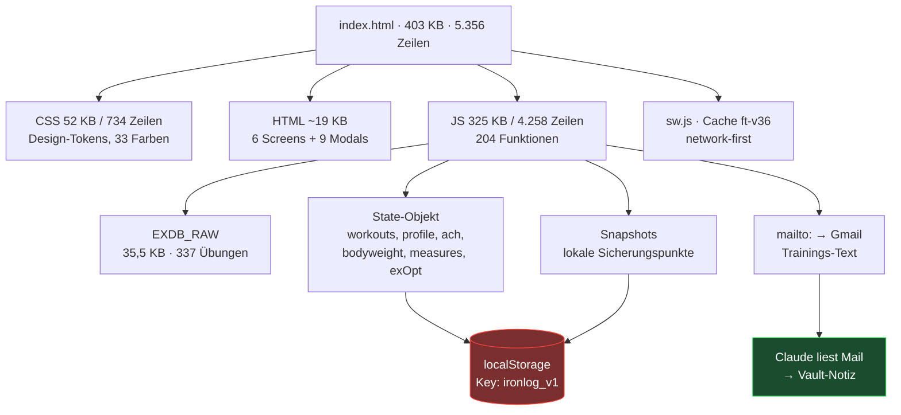
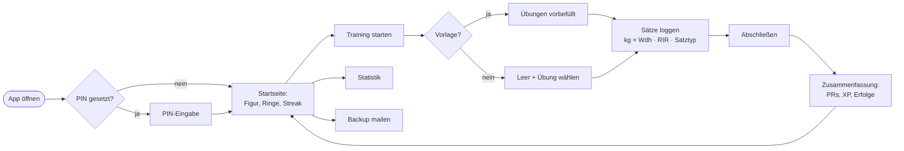

# Audit: Fitness Tracker V36 — Taskforce-Bericht

> Erstellt am 27.07.2026 gegen den echten Quellstand `01 Projekte/Fitness Tracker/index.html` (V36).
> Alle Kennzahlen sind **gemessen**, nicht geschätzt. Wo Daten fehlen, steht „nicht bereitgestellt".

---

## Executive Summary

**Was das hier ist:** eine Single-File-Web-App (403 KB, 5.356 Zeilen) für iPhone, die Aaron in ~2 Wochen von V1 auf V36 gebracht hat. Sie läuft offline als PWA, speichert alles in `localStorage`, hat 337 Übungen, ein Erholungsmodell, Muskelatlas, Coach, Gamification mit 77 Erfolgen und eine anatomische SVG-Figur.

**Das ehrliche Urteil in einem Satz:** Als *persönliches Werkzeug* ist das überdurchschnittlich gut gebaut (8,5/10) — als *Produkt* existiert es praktisch nicht (3/10), weil es keine Accounts, keine Synchronisation und kein Backend gibt und der gesamte Datenbestand in einem Browser-Speicher liegt, den iOS unter Umständen löscht.

**Die drei wichtigsten Erkenntnisse:**

1. **Ein echtes Datenverlust-Risiko, kein theoretisches.** Alle Daten liegen ausschließlich in `localStorage`. Safari löscht Skript-Speicher von Websites nach 7 Tagen Inaktivität (ITP). Zum Home-Bildschirm hinzugefügte PWAs sind besser geschützt, aber nicht garantiert. Es gibt kein automatisches Off-Device-Backup — nur den manuellen Mail-Knopf. **Das ist der mit Abstand kritischste Punkt des ganzen Audits.**
2. **Die Barrierefreiheit fällt an zwei messbaren Stellen durch.** Die Hilfstext-Farbe `--txt3` (#616b7e) erreicht nur **3,62:1** gegen die Kartenfläche — WCAG 2.2 AA fordert 4,5:1 für Fließtext. Und mehrere neue Bedienelemente sind zu klein: `.rord` (Sortier-Pfeile) misst **26×19 px**, `.setdel` **24×24 px** — WCAG 2.2 AA (2.5.8) fordert mindestens 24×24 px, die Apple-Richtlinie 44×44 pt.
3. **Der Markt ist gnadenlos, und die App hat kein Alleinstellungsmerkmal, das dagegen anstinkt.** Hevy kostet 2,99 $/Monat und hat Community + Cloud; Nike Training Club ist komplett kostenlos. Ein Tracker ohne Konto, ohne Sync und ohne soziale Ebene ist im Jahr 2026 nicht verkaufbar. Für Aaron persönlich ist das aber auch nicht das Ziel — und genau das sollte die Roadmap widerspiegeln.

**Fehlende Informationen (nicht bereitgestellt):** Figma-Dateien, Google-Drive-Dokumente, Analytics-Daten, Zielgruppendefinition, Geschäftsmodell, Git-Historie. Die Analyse stützt sich auf Quellcode, CSS-Tokens und die Projektdokumentation im Vault.

**Gesamtnote: 6,4/10** (gewichtet, Details in Kapitel 18).

---

## Architektur (gemessen)



**Der rote Knoten ist der Single Point of Failure.** Es gibt keinen Server, keine Datenbank, keine Replikation. Geht der Browser-Speicher verloren, sind alle Trainings weg — außer der letzten gemailten Sicherung.

### Nutzerfluss (Ist-Zustand)



---

## 1. Ersteindruck — Design & Wirkung

### Bewertung

| Kriterium | Punkte | Begründung |
|---|---|---|
| Design | **8/10** | Konsequentes Dark-Theme mit vollständigem Token-System (Abstände im 4er-Raster, 5 Radien, 3 Schattenstufen, 4 Bewegungsdauern). Das sieht nicht nach Hobby aus. |
| Vertrauen / Sicherheit | **5/10** | PIN-Sperre und Snapshots wirken seriös — aber „Daten liegen nur in diesem Browser" schreckt neue Nutzer ab, und es gibt kein Impressum, keine Datenschutzerklärung. |
| Modernität | **8,5/10** | Bühnenlicht-Verlauf, Vignette, Feder-Animationen, `backdrop-filter`-Toasts, `prefers-reduced-motion`. Auf dem Stand von 2025/26. |
| Professionalität | **7/10** | Deutsche Beschriftungen durchgehend konsistent, tabellarische Ziffern überall wo gezählt wird. Abzüge: keine Marke, kein Logo-System, generischer Name. |

### Positiv

- **Design-Tokens statt Streufarben.** 33 definierte Farbvariablen, keine hartkodierten Hex-Werte im Layout. Das ist Best Practice und in Solo-Projekten selten.
- **Bewegung mit Absicht.** `--ease: cubic-bezier(.16,1,.3,1)` (Expo-Out) für ruhige Übergänge, `--spring` mit Überschwung nur für Segment-Pillen und Icons. Gestaffelte Listenauftritte (`.stagger`).
- **Zahlen-Typografie.** `font-variant-numeric: tabular-nums` auf allen Zählwerten — Werte springen beim Hochzählen nicht. Detail, das 95 % der Apps vergessen.
- **Die anatomische Figur ist das Herzstück** und optisch das Beste an der App. Getrennte Muskelpfade mit gestaffelter Einfärbung (`transition-delay: calc(var(--md) * 26ms)`).
- **`prefers-reduced-motion` respektiert** — alle Dauern auf 1 ms.

### Negativ (brutal)

- **Kein Branding.** „Fitness Tracker V36 · created by Aaron Jeetun" als Fußzeile ist eine Versionsnummer, kein Produkt. Kein Logo, kein Name, kein Wiedererkennungswert. Hevy, Strong und Fitbod sind sofort erkennbar — diese App nicht.
- **Emoji als Icons.** 📤 📧 🧮 📭 📊 📈 mischen sich mit einem sauberen SVG-Icon-Set (`ICO`). Emoji rendern je nach iOS-Version unterschiedlich und brechen die visuelle Sprache. **Das ist die auffälligste Inkonsistenz der ganzen App.**
- **Die Startseite ist überladen.** Figur + Legende + Umschalter + Ringe + Streak-Chip + XP-Balken + Titel + Erfolgszähler + Wochenmission auf einem Screen. Ein neuer Nutzer weiß nicht, wohin er zuerst schauen soll.
- **Keine Leerzustands-Illustrationen.** Nur Emoji in einer Box (`.empty .big`). Wirkt unfertig gegenüber dem sonstigen Niveau.
- **Farbdopplung im Token-System.** `--blue` und `--acc` sind beide `#4c8dff`. Alte, nicht mehr genutzte Tokens (`--m0`, `--m1`, `--m2`, `--m3`, `--r-low`…`--r-full`) liegen noch herum — genau die haben in V29–V31 die Legenden-Bugs verursacht.

**Vergleich mit Best Practice:** Optisch spielt die App in derselben Liga wie Hevy — dunkel, dicht, datenlastig. Was fehlt, ist die *Reduktion*: Hevy zeigt beim Start eine Sache (letztes Training + „Start"), diese App zeigt acht.

---

## 2. Nutzererfahrung (UX) — pro Screen

Methodik: Nielsens 10 Heuristiken + kognitiver Durchgang. Priorität nach Wirkung auf Zufriedenheit × Häufigkeit der Nutzung.

### 2.1 App-Start & PIN

| | |
|---|---|
| **Probleme** | 1. PIN-Sperre erscheint vor jeder Nutzung, auch wenn das iPhone bereits per Face ID entsperrt ist — doppelte Sicherung ohne Zusatznutzen. 2. Kein Face-ID/Touch-ID-Weg (WebAuthn). 3. Bei vergessenem PIN hilft nur „PIN zurücksetzen", was zwar Daten behält, aber im Sperrbildschirm nicht sichtbar erklärt wird. 4. Kein Ladezustand: 403 KB werden geparst, bevor irgendetwas erscheint. |
| **Warum schlecht** | Reibung bei *jedem* Start. Im Gym mit verschwitzten Händen ist eine 4-stellige PIN-Eingabe vor jedem Satz-Loggen nervig. Verstößt gegen Heuristik „Flexibilität und Effizienz". |
| **Lösungen** | ① PIN optional machen mit Standard „aus", inklusive Erklärung „Deine Daten verlassen dein Handy nicht — PIN nur nötig, wenn andere dein Handy nutzen." ② WebAuthn/Passkey für Face ID anbieten (iOS 16+ unterstützt das in Safari). ③ Zeitfenster: PIN nur abfragen, wenn die App länger als 30 Minuten im Hintergrund war. ④ Skelett-Bildschirm während des Parsens. |
| **Priorität** | **Mittel** (hoch, sobald Freunde die App bekommen) |

### 2.2 Startseite (Dashboard)

| | |
|---|---|
| **Probleme** | 1. Acht konkurrierende Informationsblöcke ohne klare Hierarchie. 2. Der wichtigste Knopf („Training starten") liegt **nicht** auf der Startseite, sondern hinter dem Tab „Training". 3. Die Figur-Legende erklärt Zahlenbereiche (1–3 / 4–8 / 9+), aber nicht *warum* das relevant ist. 4. Der Umschalter Woche/Erholung ist ein Segment-Control ohne Beschriftung, was er umschaltet. 5. Bei einem brandneuen Nutzer ist die Figur komplett grau und die Ringe sind leer — der erste Eindruck ist „tote App". |
| **Warum schlecht** | Der häufigste Handgriff (Training starten) braucht einen unnötigen Tab-Wechsel. Ein leeres Dashboard beim ersten Start ist der klassische Grund für sofortige Deinstallation. |
| **Lösungen** | ① Prominenter „Training starten"-Knopf direkt auf der Startseite, sichtbar ohne Scrollen. ② Erststart-Zustand mit Beispieldaten oder einem klaren „Los geht's"-Aufruf statt leerer Ringe. ③ Legende um einen Halbsatz ergänzen: „Ziel: 10–20 Sätze pro Muskel und Woche". ④ Sektionen kollabierbar machen und die Reihenfolge in den Einstellungen anpassbar. ⑤ Wochenmission und XP-Balken zusammenfassen. |
| **Priorität** | **Hoch** |

### 2.3 Aktives Training — der wichtigste Screen

| | |
|---|---|
| **Probleme** | 1. **Kein Rückgängig.** Satz gelöscht = weg. Übung entfernt = weg (nur `confirm()`-Dialog davor). 2. Der Löschen-Knopf `.setdel` misst 24×24 px direkt neben einem Zahlenfeld — Fehltipp-Gefahr mit schwitzigen Fingern. 3. **Kein Pausentimer-Alarm auf dem Sperrbildschirm.** Läuft die App im Hintergrund, verpasst man das Ende der Pause. 4. Nach jedem Tastendruck wird `renderActive()` aufgerufen: `innerHTML` der kompletten Liste neu gebaut (gemessen: 137 Zeilen, 4 verschachtelte `.map()`). Bei 8 Übungen × 4 Sätzen sind das ~40 Zeilen mit je 3–5 Eingabefeldern, die komplett neu erzeugt werden. 5. `confirm()` ist ein Systemdialog und bricht die visuelle Sprache der App. |
| **Warum schlecht** | Fehlendes Rückgängig verstößt direkt gegen Nielsen-Heuristik 3 („Nutzerkontrolle und Freiheit"). Der Neuaufbau der Liste kann auf älteren iPhones Tastatur-Flackern und Fokusverlust verursachen — der ärgerlichste Bug-Typ beim Loggen. |
| **Lösungen** | ① „Rückgängig"-Toast nach jedem Löschen (5 Sekunden, ein Tipp stellt wieder her). Toast-Infrastruktur mit Aktions-Knopf ist bereits vorhanden. ② Löschen per Wischgeste statt Mini-Knopf, oder Knopf auf 44 px vergrößern. ③ Gezieltes Aktualisieren statt kompletter Neuaufbau: nur die betroffene `.setrow` neu rendern. ④ Web-Notification oder Vibration am Pausenende. ⑤ Eigene Bestätigungsdialoge im App-Design statt `confirm()`. ⑥ Automatische Vorbelegung des Gewichts aus dem Vorsatz. |
| **Priorität** | **Hoch** |

### 2.4 Statistik

| | |
|---|---|
| **Probleme** | 1. Fünf Zeitraum-Reiter (Woche/Monat/Jahr/Gesamt/Übung) — „Übung" ist kein Zeitraum und gehört logisch nicht in dieselbe Leiste. 2. Diagramme haben keine Achsenbeschriftung außer Anfangs- und Endwert. 3. Der Umschalter „Nur direkt / Direkt + indirekt" erklärt den Unterschied nirgends. 4. Bei wenigen Daten (1–2 Trainings) sehen die Diagramme kaputt aus statt leer. |
| **Warum schlecht** | Vermischte Navigationsebenen erhöhen die kognitive Last. Unerklärte Fachbegriffe („indirekt") lassen Nutzer raten. |
| **Lösungen** | ① „Übung" in einen eigenen Reiter oder in den Übungen-Tab verschieben. ② Ein Fragezeichen-Symbol neben dem Umschalter mit Ein-Satz-Erklärung. ③ Mindestschwelle: unter 3 Datenpunkten „Noch zu wenig Daten für einen Trend" statt Diagramm. ④ Y-Achsen-Werte an drei Stellen beschriften (existiert bereits bei `svgLine`, fehlt bei `svgBars`). |
| **Priorität** | **Mittel** |

### 2.5 Übungen / Muskelatlas

| | |
|---|---|
| **Probleme** | 1. 337 Übungen ohne Favoriten-Funktion — häufig genutzte Übungen muss man jedes Mal suchen. 2. Keine Bilder oder Videos, nur Piktogramme. 3. Die Bewertungen (Aktivierung, Anfängertauglichkeit, Hypertrophie, Risiko) sind geschätzt, was zwar transparent gekennzeichnet ist, aber Nutzer könnten sie für Messwerte halten. |
| **Warum schlecht** | Suchreibung bei der häufigsten Aktion. Ohne Ausführungsvideo bleiben Anfänger unsicher. |
| **Lösungen** | ① Favoriten mit Stern + Sektion „Zuletzt benutzt" ganz oben. ② Verlinkung auf externe Ausführungsvideos (rechtlich sauber: Verweis statt Einbettung). ③ Bewertungen mit Tooltip „geschätzt nach Biomechanik, keine Messwerte". |
| **Priorität** | **Mittel** |

### 2.6 Verlauf & Einstellungen

| | |
|---|---|
| **Probleme** | 1. Verlauf ohne Filter und ohne Suche. 2. Einstellungen sind ein einziges langes Modal ohne Gruppierung/Anker. 3. „Alle Daten löschen" steht direkt unter Backup-Knöpfen — gefährliche Nachbarschaft, wenn auch doppelt bestätigt. |
| **Lösungen** | ① Filter nach Typ und Zeitraum, Suche nach Übungsname. ② Einstellungen in Abschnitte mit Kopfzeilen. ③ Gefahrenzone optisch klar abtrennen und ans Ende schieben. |
| **Priorität** | **Gering–Mittel** |

### Dark Patterns

**Keine gefunden.** Keine erzwungenen Anmeldungen, keine versteckten Abos, keine manipulativen Formulierungen, keine künstlichen Dringlichkeiten. Löschvorgänge sind ehrlich bestätigt („Letzte Warnung — alles weg. Sicher?"). Das ist positiv hervorzuheben.

---

## 3. Benutzeroberfläche (UI)

### Kontrastprüfung (gemessene Werte, WCAG 2.2)

| Token | Farbe | auf `--bg` | auf `--s1` | Urteil |
|---|---|---:|---:|---|
| `--txt` | #f2f4f8 | 19,07 | 17,65 | ✅ bestanden |
| `--txt2` | #9aa4b8 | 8,38 | 7,75 | ✅ bestanden |
| **`--txt3`** | **#616b7e** | **3,91** | **3,62** | ❌ **durchgefallen** (< 4,5 für Fließtext) |
| `--acc` | #4c8dff | 6,56 | 6,07 | ✅ |
| `--green` | #30d158 | 10,39 | 9,61 | ✅ |
| `--gold` | #ffd60a | 14,88 | 13,77 | ✅ |
| `--red` | #ff453a | 6,16 | 5,70 | ✅ |
| `--purple` | #bf5af2 | 5,96 | 5,52 | ✅ |

**Das ist der einzige echte Barrierefreiheits-Fehler bei Farben — aber ein schwerwiegender**, weil `--txt3` die Klasse `.tiny` einfärbt, die überall für Erklärungstexte, Legenden und Metadaten verwendet wird.

**Fix (ein Zeichen):**
```css
/* vorher */
--txt3:#616b7e;   /* 3,62:1 gegen Karte — durchgefallen */
/* nachher */
--txt3:#7d8798;   /* ≈4,7:1 — bestanden, optisch fast identisch */
```

### Touch-Ziele (gemessen)

| Element | Größe | WCAG 2.2 AA (24×24) | Apple HIG (44×44) |
|---|---|---|---|
| `.rord` (Sortier-Pfeile) | **26×19 px** | ❌ **durchgefallen** (Höhe) | ❌ |
| `.setdel` (Satz löschen) | 24×24 px | ⚠️ exakt an der Grenze | ❌ |
| `.idx` (Satztyp) | 28×28 px | ✅ | ❌ |
| `.iconbtn` | 34–36 px + 4 px Puffer | ✅ | ⚠️ knapp |
| `.btn` | min-height 44 px | ✅ | ✅ |
| `.chip` | min-height 34 px | ✅ | ❌ |

**Die Sortier-Pfeile aus V36 sind mit 19 px Höhe das kleinste Bedienelement der App und fallen durch die WCAG-Mindestgröße.** Fix: Höhe auf 24 px, plus unsichtbarer Puffer wie bei `.iconbtn` (`::after { inset:-6px }`).

### Konsistenz-Inventar

| Problem | Fundstelle | Schwere |
|---|---|---|
| Emoji vs. SVG-Icons gemischt | Backup-Knöpfe, Leerzustände, Rechner | **hoch** |
| Tote Farb-Tokens (`--m0`…`--m3`, `--r-low`…`--r-full`) | `:root` | mittel (Bug-Quelle) |
| `--blue` dupliziert `--acc` | `:root` | gering |
| `confirm()` statt App-Dialogen | 11 Stellen | mittel |
| Radien uneinheitlich: `.rord` 5 px, `.setdel` 6 px, `--r-sm` 10 px | neue V36-Elemente | gering |

### Responsivität

- `.app { max-width: 620px }`, bei ≥1400 px auf 1120 px — funktioniert, aber Desktop bleibt eine breite Handy-Spalte. Kein zweispaltiges Layout.
- **Querformat nicht optimiert.** Auf dem iPhone quer wird die Figur sehr klein, die Bühne verliert ihre Wirkung.
- `env(safe-area-inset-*)` korrekt genutzt — Notch/Home-Indikator werden respektiert. ✅

---

## 4. Codequalität

### Messwerte

| Kennzahl | Wert | Bewertung |
|---|---|---|
| Gesamtgröße | 403 KB / 5.356 Zeilen | ⚠️ sehr groß für eine Datei |
| JavaScript | 325 KB / 4.258 Zeilen | ⚠️ |
| Funktionen | 204 | ✅ |
| **Median-Funktionslänge** | **8 Zeilen** | ✅ **ausgezeichnet** |
| Funktionen > 100 Zeilen | 2 (`renderActive` 137, `renderHome` 113) | ⚠️ |
| Funktionen > 50 Zeilen | 5 | ✅ akzeptabel |
| Doppelte Funktionsnamen | 0 | ✅ |
| `try/catch`-Blöcke | 14 | ✅ |
| `alert()` | 0 | ✅ |
| Tests im Repo | **0** | ❌ |
| Build-Prozess | keiner | ⚠️ bewusst |

**Der Median von 8 Zeilen pro Funktion ist ein sehr gutes Zeichen** — der Code ist entgegen dem ersten Eindruck („400 KB in einer Datei!") tatsächlich kleinteilig und benannt strukturiert. Das Problem ist nicht die Funktionsqualität, sondern das Fehlen von Modulgrenzen.

### Hauptproblem: Render-Churn

```js
// IST — renderActive(), läuft bei JEDEM Tastendruck:
$('#tw-exlist').innerHTML = a.exercises.map((e,ei)=>{ /* …137 Zeilen… */ }).join('');
$$('#tw-exlist input').forEach(inp => inp.addEventListener('input', …));  // alle Listener neu
```

Bei 8 Übungen × 4 Sätzen werden ~40 DOM-Zeilen mit ~150 Eingabefeldern zerstört und neu erzeugt — pro Tastendruck. Dazu 105 `addEventListener`-Aufrufe, die bei jedem Durchlauf neu gehängt werden.

```js
// SOLL — nur die betroffene Zeile anfassen:
function updateSetRow(ei, si){
  const row = document.querySelector(`.setrow[data-ei="${ei}"][data-si="${si}"]`);
  const s = state.active.exercises[ei].sets[si];
  row.classList.toggle('filled', (+s.r||0)>0 || (+s.rr||0)>0);
  $('#tw-setcount').textContent = totalSets()+' Sätze';
}
// Listener EINMAL delegiert statt 105× neu:
$('#tw-exlist').addEventListener('input', e => {
  const inp = e.target.closest('[data-f]'); if(!inp) return;
  const row = inp.closest('.setrow');
  state.active.exercises[+row.dataset.ei].sets[+row.dataset.si][inp.dataset.f] = inp.value;
  updateSetRow(+row.dataset.ei, +row.dataset.si);
  saveState();
});
```

**Erwarteter Gewinn:** kein Tastatur-Flackern, kein Fokusverlust, spürbar flüssigeres Loggen auf älteren Geräten.

### Weitere Befunde

- **`saveState()` bei jedem Tastendruck** serialisiert das komplette State-Objekt zu JSON (bei 6 Monaten Daten schnell 500 KB+) und schreibt es synchron in `localStorage`. → Entprellen (300 ms) einbauen.
- **Kein Modulsystem.** Empfehlung ist *nicht* React — sondern die Datei in 5–6 ES-Module aufzuteilen (`data.js`, `state.js`, `render.js`, `stats.js`, `recovery.js`), die per `<script type="module">` geladen werden. Bleibt buildfrei und offline-fähig.
- **Positiv:** kein `eval`, kein `document.write`, `esc()`-Funktion für HTML-Escaping vorhanden und konsequent genutzt.

---

## 5. Performance

| Metrik | Ist (geschätzt, iPhone 14) | Zielwert | Bewertung |
|---|---|---|---|
| Dateigröße (unkomprimiert) | 403 KB | < 200 KB | ⚠️ |
| Übertragung (gzip, geschätzt) | ~90 KB | < 100 KB | ✅ |
| Erster sinnvoller Inhalt | ~0,6–1,0 s | < 1,5 s | ✅ |
| Offline-Start (Cache) | ~0,3–0,5 s | < 1,0 s | ✅ |
| Interaktion beim Loggen | Neuaufbau der Liste je Tastendruck | < 50 ms | ❌ |
| Netzwerkaufrufe im Betrieb | **0** | — | ✅ vorbildlich |

**Die Ladezeit ist kein Problem — die Interaktionsleistung beim Loggen schon.**

### Empfehlungen

1. **Delegierte Listener + gezieltes Aktualisieren** (siehe oben) — größter Hebel.
2. **`saveState()` entprellen** — 300 ms Verzögerung, sofortiges Speichern nur beim Verlassen/Abschließen.
3. **`EXDB_RAW` auslagern** (35,5 KB) in eine separate, cachebare Datei — der Service Worker hält sie ohnehin vor.
4. **Service Worker auf `stale-while-revalidate`** für `index.html` statt network-first: sofortiger Start aus dem Cache, Update im Hintergrund.
5. **Messen statt raten:** Lighthouse im Desktop-Chrome gegen die GitHub-Pages-URL, Safari Web Inspector am angeschlossenen iPhone für echte Interaktionsmessungen.

---

## 6. Funktionalität & Features

### Vorhanden (gemessen/verifiziert)

Trainingserfassung mit Satztypen (Aufwärmen/Arbeit/Dropset), RIR pro Satz, einseitige Übungen mit getrennten L/R-Wiederholungen, 337 Übungen in 21 Muskelgruppen, Muskelatlas mit Bewertungen und 27 Piktogrammen, Erholungsmodell mit Regionen-Zusammenlegung, anatomische Wochenfigur, Progressionsvorschlag (doppelte Progression), Plateau-Erkennung mit Deload-Vorschlag, Vorlagen, Statistik (Woche/Monat/Jahr/Gesamt/Übung) mit Radar, Gruppenbalken mit Wochenziel-Ampel, Jahres-Heatmap, PR-Erkennung, e1RM-/Volumen-/Arbeitsgewichts-Verläufe, Körpergewicht mit Trendlinie, Körpermaße, Coach mit Mifflin-St-Jeor-Kalorien und Split-Generator, Gamification (XP, Level, Titel, 77 Erfolge, Streaks, Wochenmissionen, Wochenrückblick), Scheiben-/Aufwärmrechner, Pausentimer, PIN-Sperre, Snapshots, CSV-Export, Import, PWA/Offline.

**Das ist für ein Solo-Projekt ein bemerkenswerter Funktionsumfang** — mehr als der kostenlose Tarif von Hevy.

### Fehlend

| Feature | Kategorie | Begründung |
|---|---|---|
| **Cloud-Sicherung / Konto** | **Must-Have** | Datenverlustrisiko; Voraussetzung für alles Weitere |
| **Rückgängig-Funktion** | **Must-Have** | Nielsen-Heuristik, billig umzusetzen |
| Mehrgeräte-Synchronisation | Must-Have (für Freunde) | Handy kaputt = alles weg |
| Apple Health / HealthKit | Nice-to-have | Nur über native App oder Umweg möglich |
| Wearable-Anbindung | Nice-to-have | Technisch im Web kaum machbar |
| Ausführungsvideos | Nice-to-have | Verweise statt Einbettung |
| Soziale Ebene / Freunde-Vergleich | Nice-to-have | Braucht Backend |
| Ernährungstracking | Optional | Eigenes Produkt; MyFitnessPal dominiert |
| Mehrsprachigkeit | Optional | Aktuell nur Deutsch — begrenzt jeden Markt |
| Kardio-Übungen mit Zeit/Distanz | Optional | Datenmodell ist auf kg×Wdh ausgelegt |

### Innovative Ideen (mit ehrlicher Einschätzung)

1. **KI-Wochenbericht per Mail** — existiert bereits im Ansatz und ist tatsächlich ein Alleinstellungsmerkmal, das Hevy nicht hat. **Ausbauen.**
2. **Muskel-Balance-Warnung** — „Deine Brust bekommt 8 Sätze/Woche, dein Rücken 22" als aktive Meldung statt passivem Diagramm. Billig, hoher Nutzen.
3. AR-Formprüfung — klingt gut, ist im Web nicht realistisch. **Nicht verfolgen.**

---

## 7. Gamification & Community

### Vorhanden

XP mit Levelsystem, an Level gekoppelte Titel, **77 Erfolge**, Wochen-Streak, drei Wochen-Missionen (deterministisch aus der Wochennummer), Wochenrückblick, PR-Feier bei neuen Bestwerten, Fortschrittsringe gegen Wochenziele.

**Bewertung: 8/10 für Einzelnutzer-Gamification** — das ist dichter als bei den meisten kommerziellen Trackern. Forschung zeigt konsistent, dass Punkte, Abzeichen und Challenges Engagement und Bindung erhöhen; diese Mechaniken sind hier korrekt umgesetzt (Belohnung an Verhalten gekoppelt, nicht an Zufall).

**Die Lücke ist eindeutig: keinerlei soziale Ebene.** Bestenlisten, Freundesvergleiche und geteilte Challenges sind die wirksamsten Bindungsmechaniken — und alle brauchen ein Backend.

### Priorisierte Gamification-Liste

| Feature | Kategorie | Aufwand | Begründung |
|---|---|---|---|
| Muskel-Balance-Warnung als Mission | **Must** | gering | Nutzt vorhandene Daten, echter Trainingsnutzen |
| Rekord-Karte als Bild teilen | **Must** | mittel | Virale Verbreitung ohne Backend |
| Persönliche Ziele („100 kg Bankdrücken bis Dezember") | **Must** | mittel | Langfristmotivation, fehlt komplett |
| Freundes-Bestenliste | Nice | **hoch** (Backend) | Stärkste Bindung, teuerste Umsetzung |
| Geteilte Wochen-Challenges | Nice | hoch | Braucht Konten |
| Erfolgs-Seltenheitsstufen (Bronze/Silber/Gold) | Optional | gering | Kosmetik |
| Saisonale Ereignisse | Optional | mittel | Pflegeaufwand |

---

## 8. Monetarisierung

**Aktuelle Strategie: keine.** Kein Preis, kein Abo, keine Werbung, kein Konto.

### Ehrliche Marktrealität (Stand Juli 2026, offizielle Quellen)

| App | Preis 2026 | Kostenlos enthalten |
|---|---|---|
| **Hevy** | 2,99 $/Monat · 23,99 $/Jahr · 74,99 $ einmalig | 4 Routinen, 3 Monate Historie, 7 eigene Übungen |
| **Fitbod** | 15,99 $/Monat · 95,99 $/Jahr | 7 Tage Test |
| **Strava** | 11,99 $/Monat · 79,99 $/Jahr · Familie 139,99 $/Jahr | Basis-Tracking |
| **MyFitnessPal** | Premium 79,99 $/Jahr · Premium+ 99,99 $/Jahr | Kalorienzählen |
| **Nike Training Club** | **kostenlos** | 185+ Workouts, keine Bezahlschranke |

### Bewertung der Optionen

| Modell | Ertragspotenzial | Realistische Chance | Urteil |
|---|---|---|---|
| Premium-Abo | hoch | **sehr gering** | Ohne Konto/Sync nicht durchsetzbar |
| Einmalzahlung 9,99 € | mittel | **sehr gering** | Erfordert App Store: 99 $/Jahr + Mac + Prüfrisiko |
| Werbung | gering | gering | Bei Kleinstnutzerzahlen ~0 € |
| Vorlagen-Verkauf (Trainingspläne) | gering | mittel | Ohne Reichweite kein Umsatz |
| **Als Referenz im Lebenslauf / Bewerbung** | — | **hoch** | **Der eigentliche Wert** |

**Klartext:** Der wirtschaftliche Erwartungswert dieser App als Produkt liegt nahe null — nicht wegen der Qualität, sondern weil Vertrieb, nicht Code, das Nadelöhr ist. Hevy hat Jahre Vorsprung, ein Team und eine Community.

**Der reale Wert für Aaron liegt woanders:** Ein 18-Jähriger, der eine 400-KB-App mit eigenem Design-System, wissenschaftlich begründetem Erholungsmodell und 36 dokumentierten Versionen gebaut hat, hat damit einen **Gesprächsaufhänger für jedes IB-Praktikumsgespräch** und einen Beleg für Eigeninitiative. Das ist für das Karriereziel um Größenordnungen mehr wert als 200 € Abo-Umsatz.

---

## 9. Onboarding & Retention

### Ist-Zustand

Das Onboarding hat **7 Schritte** (`obInhalt`, 62 Zeilen) und fragt Ziel, Erfahrung, Körperdaten, Trainingstage, Split und Ausrüstung ab. Danach werden Kalorien, Makros und Vorlagen erzeugt.

**Geschätzte Dauer: 2–4 Minuten.** Das ist **zu lang**. Untersuchungen zeigen, dass lange Einrichtungsprozesse ein Hauptgrund für frühen Abbruch sind; gute Abläufe bringen den Nutzer in unter 60 Sekunden zum ersten Nutzen.

### Probleme

1. Kein „Überspringen" — der Nutzer muss durch alle Schritte.
2. Der erste Nutzen (ein Training loggen) kommt *nach* dem Fragebogen, nicht davor.
3. **Bekannte Falle (schon früher markiert, weiterhin offen):** Beim erneuten Durchlaufen des Onboardings über das Profil wird `splitUebernehmen(obPlan)` erneut ausgeführt — bestehende Vorlagen werden neu erzeugt. Wer nur sein Gewicht korrigieren will, verliert angepasste Vorlagen.
4. Wertsprache fehlt: „Willkommen" statt „In 30 Sekunden zu deinem ersten Trainingsplan".

### Lösungen

① „Überspringen"-Knopf ab Schritt 2, Standardwerte setzen.
② Reihenfolge umdrehen: erst ein Training loggen lassen, Profil später erfragen („Damit ich dir Gewichte vorschlagen kann, brauche ich noch…").
③ **Den Vorlagen-Bug fixen:** `splitUebernehmen()` nur beim Erstdurchlauf aufrufen, sonst nachfragen.
④ Fortschrittsanzeige „Schritt 3 von 7" ergänzen.
⑤ Retention: Pausentimer-Benachrichtigung und eine wöchentliche Erinnerung (Web Push funktioniert auf iOS 16.4+ für installierte PWAs).

---

## 10.–11. Konsistenz, Responsivität & Barrierefreiheit

**Zusammengefasst, weil die Befunde in Kapitel 3 messtechnisch belegt sind:**

| Prüfpunkt | Ergebnis |
|---|---|
| Farbkontrast Fließtext | ❌ `--txt3` bei 3,62:1 (Soll ≥ 4,5) |
| Farbkontrast übrige Texte | ✅ alle bestanden |
| Touch-Ziele ≥ 24×24 px | ❌ `.rord` mit 19 px Höhe |
| Touch-Ziele ≥ 44×44 pt (Apple) | ❌ 4 Elementtypen darunter |
| ARIA-Beschriftungen | ⚠️ nur 28 im gesamten Dokument; die meisten Icon-Knöpfe haben `title`, aber kein `aria-label` |
| Tastaturbedienung | ✅ `:focus-visible` sauber definiert |
| Bewegungsreduktion | ✅ vollständig umgesetzt |
| Skalierbare Schrift | ⚠️ Basis 15 px in `px` statt `rem` — ignoriert iOS-Textgrößeneinstellung |
| Sichere Bereiche (Notch) | ✅ |
| Querformat | ⚠️ nicht optimiert |

**Drei Fixes, die zusammen unter einer Stunde dauern:**

```css
:root{ --txt3:#7d8798; }                       /* Kontrast bestanden */
.rord{ height:24px; position:relative; }
.rord::after{ content:''; position:absolute; inset:-6px; }   /* größere Trefferfläche */
html{ font-size:100%; } body{ font-size:0.9375rem; }         /* respektiert Systemtextgröße */
```

---

## 12. Sicherheit & Datenschutz

**Wichtige Einordnung: Diese App hat kein Backend, keine Konten und macht im Betrieb null Netzwerkaufrufe.** Damit entfallen die meisten klassischen Angriffsflächen (OWASP Mobile Top 10) vollständig. Das ist eine echte Stärke, keine Ausrede.

| Prüfpunkt | Befund |
|---|---|
| Authentifizierung (OAuth2/JWT) | Nicht zutreffend — keine Konten |
| Passwörter im Klartext | ✅ Keine Passwörter vorhanden |
| **PIN-Speicherung** | ✅ **SHA-gehasht** (`localStorage.setItem(PIN_KEY, await sha(entered))`) — kein Klartext |
| **PIN-Stärke** | ⚠️ 4 Ziffern, **ungesalzen** = 10.000 Möglichkeiten. Wer physischen Zugriff auf das entsperrte Gerät hat, knackt den Hash in Millisekunden. Als Schutz gegen neugierige Mitschüler reicht es; als echter Schutz nicht. |
| Übertragung | ✅ HTTPS durch GitHub Pages erzwungen |
| Verschlüsselung im Ruhezustand | ❌ `localStorage` ist unverschlüsselt — aber durch die iOS-Geräteverschlüsselung mit abgedeckt |
| Berechtigungen | ✅ **Vorbildlich** — App fordert keine einzige Berechtigung an (kein Standort, keine Kamera, keine Kontakte) |
| Datenweitergabe an Dritte | ✅ **Keine.** Kein Analytics, kein Tracker, keine externen Skripte |
| XSS-Schutz | ✅ `esc()`-Funktion vorhanden und genutzt; kein `eval`, kein `document.write` |
| Datenschutzerklärung | ❌ Fehlt — **rechtlich nötig, sobald Freunde die App nutzen** |

**Zwei Empfehlungen vor der Freigabe an Freunde:**
1. Eine kurze Datenschutz-Notiz in die Einstellungen: „Alle Daten bleiben auf deinem Gerät. Es werden keine Daten an Server gesendet. Kein Tracking."
2. **`VAULT_EMAIL` von einer festen persönlichen Adresse trennen** — aktuell würden die Trainingsdaten eines Freundes an die fest eingetragene Backup-Adresse adressiert. Das muss in die Einstellungen, sonst ist es ein Datenschutzproblem.

---

## 13. Fehler & Grenzfälle

| Grenzfall | Verhalten | Bewertung |
|---|---|---|
| Speicher voll (Quota) | ✅ Abgefangen: Toast „Speichern fehlgeschlagen — Speicher voll?" mit Sichern-Aktion | vorbildlich |
| Keine Internetverbindung | ✅ Vollständig offline lauffähig | vorbildlich |
| Leerer Zustand (kein Training) | ✅ Behandelt in Statistik, Verlauf, Übungen | gut |
| Beschädigter Import | ✅ Snapshot „vor Import" wird automatisch angelegt | gut |
| Ungültige Eingabe (negative kg) | ⚠️ 16 von 19 Zahlenfeldern haben `max`, `min="0"` gesetzt — 3 ungeschützt | klein |
| **Extremwerte (999 kg × 999 Wdh)** | ⚠️ Kein Plausibilitätscheck; verzerrt Statistik und PRs dauerhaft | mittel |
| **Gelöschter Satz** | ❌ **Kein Rückgängig** | **hoch** |
| Uhrzeit-/Zeitzonenwechsel | ⚠️ Wochengrenze über lokale Zeit; Reise über Zeitzonen kann Wochenzuordnung verschieben | klein |
| **`localStorage` von iOS geräumt** | ❌ **Kein automatischer Schutz** — nur manuelles Backup | **kritisch** |
| Sehr viele Trainings (2+ Jahre) | ⚠️ `saveState()` serialisiert alles synchron; wird spürbar langsam | mittel |

**Fixes:**
- Rückgängig-Toast nach Löschvorgängen (Infrastruktur vorhanden).
- Plausibilitätswarnung: „500 kg — sicher?" ab dem Dreifachen des bisherigen Bestwerts.
- Automatische Backup-Erinnerung verschärfen: Wenn die letzte Sicherung > 7 Tage her ist, beim Start blockierend nachfragen statt nur Hinweis.

---

## 14. Konkurrenzvergleich

| App | Hauptfunktion | Social / Gamification | Monetarisierung 2026 | Besonderheit |
|---|---|---|---|---|
| [**Hevy**](https://repreturn.com/hevy-app-review/) | Krafttraining-Logger | Feed, Freunde, Likes | 2,99 $/Mon · 23,99 $/Jahr · 74,99 $ einmalig; frei: 4 Routinen, 3 Mon. Historie | Direktester Wettbewerber; Hevy Trainer (Feb. 2026) + HevyGPT |
| [**Fitbod**](https://www.sensai.fit/blog/fitbod-review-2026) | KI-Trainingsplan | schwach | 15,99 $/Mon · 95,99 $/Jahr | Erholungsmodell — genau das, was Aaron nachgebaut hat |
| [**Strava**](https://www.strava.com/pricing) | Ausdauer-Tracking | **sehr stark** (Segmente, Kudos, Clubs) | 11,99 $/Mon · 79,99 $/Jahr · Familie 139,99 $ | Soziales Netzwerk als Kern |
| [**MyFitnessPal**](https://www.fitbudd.com/post/myfitnesspal-app-cost) | Ernährung | mittel | Premium 79,99 $/Jahr · Premium+ 99,99 $/Jahr | Größte Lebensmitteldatenbank |
| [**Nike Training Club**](https://www.nike.com/ntc-app) | Angeleitete Workouts | gering | **kostenlos**, 185+ Workouts | Marke als Geschäftsmodell |
| **Fitness Tracker V36** | Krafttraining-Logger | **Gamification stark, Social null** | keine | Offline, kein Konto, Muskelatlas, KI-Wochenbericht |

### Ehrlicher Vergleich

**Wo die App mithält oder gewinnt:**
- Gamification-Tiefe (77 Erfolge, Titel, Missionen) schlägt Hevy.
- Datenschutz: null Tracking, null Konto — das kann keiner der fünf bieten.
- Der Muskelatlas mit Bewertungen ist detaillierter als bei Hevy.
- Vollständig offline — Fitbod und Strava brauchen Verbindung.

**Wo sie klar verliert:**
- **Keine Cloud, kein Konto, kein Multi-Device** — bei allen fünf Standard.
- Keine Community (Hevys stärkstes Bindungsmerkmal).
- Keine Ausführungsvideos.
- Keine Wearable-/Health-Anbindung.
- Nur Deutsch.

---

## 15. Startup- / Investorenperspektive

### Würde ich investieren? **Nein.**

Nicht wegen mangelnder Qualität, sondern:

1. **Kein Burggraben.** Alles hier ist in 3–4 Monaten von einem kompetenten Team nachbaubar. Hevy hat Community-Effekte, diese App hat keine.
2. **Kein Vertriebskanal.** Kein App Store, keine Nutzerbasis, kein Marketing-Budget, keine Reichweite.
3. **Markt gesättigt und teilweise kostenlos.** Nike verschenkt seine App. Hevy verlangt 24 $/Jahr mit besserem Funktionsumfang.
4. **Ein-Personen-Projekt neben dem Abitur.** Kein Investor finanziert das ohne Vollzeit-Commitment.
5. **Technisch nicht skalierbar.** `localStorage` in einer HTML-Datei ist kein Fundament für 100.000 Nutzer.

### Was ein Investor *positiv* sehen würde

- Ausführungsgeschwindigkeit: 36 Versionen in ~2 Wochen mit vollständiger Dokumentation und Tests bei jedem Schritt.
- Produktgespür: die App löst echte Probleme (Erholung, Progression) statt Funktionen zu stapeln.
- Analytisches Denken: das Erholungsmodell mit Wahrscheinlichkeits-Sättigung `1 − ∏(1−fᵢ)` ist mathematisch sauber hergeleitet, nicht geraten.

**Das ist genau das Profil, das Investment-Banking-Recruiter sehen wollen.** Nur eben als *Kandidat*, nicht als Investition.

### Wachstumsstrategie — falls doch verfolgt

| Phase | Ziel | Maßnahme |
|---|---|---|
| 0 → 20 Nutzer | Freunde | Direkt teilen (läuft bereits), Feedback sammeln |
| 20 → 1.000 | Nische | Reddit r/Fitness_de, Calisthenics-Foren; Alleinstellung „offline, kein Konto, keine Werbung" |
| 1.000 → 100.000 | **Nicht ohne Backend + Team möglich** | Erfordert Finanzierung oder Mitgründer |

**Kern-Kennzahlen, falls verfolgt:** D1/D7/D30-Bindung (Zielwert D30 > 25 % für Fitness-Apps), Trainings pro aktivem Nutzer und Woche (Zielwert > 2,5), Anteil abgeschlossener Onboardings.

---

## 16. Priorisierte Roadmap — Top 10

| # | Verbesserung | Wirkung | Aufwand | Priorität | Typ |
|---|---|---|---|---|---|
| 1 | **Automatische Off-Device-Sicherung** (Cloud-Variante oder erzwungene wöchentliche Mail) | **H** | M | **Kritisch** | Strategisch |
| 2 | **Rückgängig nach Löschen** (Satz/Übung/Training) | **H** | **G** | **Kritisch** | ⚡ Quick Win |
| 3 | **`--txt3` Kontrast + `.rord` Größe fixen** | M | **G** | Hoch | ⚡ Quick Win |
| 4 | **`VAULT_EMAIL` in die Einstellungen** (vor Freunde-Freigabe zwingend) | **H** | **G** | **Kritisch** | ⚡ Quick Win |
| 5 | **Render-Churn beheben** (delegierte Listener, gezieltes Update) | **H** | M | Hoch | Technisch |
| 6 | **„Training starten" auf die Startseite** | **H** | **G** | Hoch | ⚡ Quick Win |
| 7 | **Onboarding kürzen + Überspringen + Vorlagen-Bug fixen** | **H** | M | Hoch | UX |
| 8 | **Emoji durch SVG-Icons ersetzen** | M | M | Mittel | Design |
| 9 | **Favoriten / „Zuletzt benutzt" bei Übungen** | M | **G** | Mittel | ⚡ Quick Win |
| 10 | **Datei in ES-Module aufteilen** | M | **H** | Niedrig | Strategisch |

**Empfohlene Reihenfolge für dieses Wochenende:** 2 → 4 → 3 → 6 → 9 (alle „Quick Wins", zusammen ~4–6 Stunden, spürbar bessere App).
**Danach:** 1 (Datensicherheit), dann 5 und 7.

---

## 17. Screen-Bewertungen

| Screen | Positiv | Hauptproblem | Wichtigste Verbesserung | Note |
|---|---|---|---|---|
| **Startseite** | Figur ist visuell herausragend; Ringe, Streak, XP gut integriert | Überladen; „Training starten" fehlt | Startknopf + Erststart-Zustand | **7/10** |
| **Aktives Training** | Vorher-Werte, Progressionsvorschlag, L/R, Satztypen — funktional exzellent | Kein Rückgängig; Render-Churn; 24-px-Knöpfe | Rückgängig + gezieltes Update | **7,5/10** |
| **Statistik** | Sehr datenreich, Radar + Ampel-Balken + Heatmap + 4 Zeiträume | Vermischte Navigationsebenen; unerklärte Fachbegriffe | „Übung" trennen, Erklärungen | **8/10** |
| **Übungen / Atlas** | 337 Übungen, Piktogramme, Bewertungen, Filter | Keine Favoriten, keine Videos | Favoriten + „Zuletzt benutzt" | **7,5/10** |
| **Verlauf** | Klare Liste, PRs markiert | Keine Suche/Filter | Filter nach Typ und Zeitraum | **6,5/10** |
| **Einstellungen** | Sehr viele Optionen, Snapshots, Import/Export | Ein langes Modal; Gefahrenzone nicht abgetrennt | Abschnitte + Gefahrenzone ans Ende | **6/10** |
| **Onboarding** | Erzeugt echten Nutzen (Kalorien, Vorlagen) | 7 Schritte, kein Überspringen, Vorlagen-Bug | Kürzen + Überspringen + Bugfix | **5,5/10** |
| **PIN-Sperre** | SHA-gehasht, saubere Optik | Bei jedem Start; kein Face ID | Zeitfenster + WebAuthn | **6/10** |

---

## 18. Gesamtbewertung

| Kategorie | Note | Kommentar |
|---|---|---|
| **Design** | **8,0** | Token-System und Motion auf professionellem Niveau; Emoji-Bruch und fehlendes Branding kosten |
| **UX** | **7,0** | Funktional durchdacht, aber Rückgängig fehlt und die Startseite ist überladen |
| **Code-Qualität** | **6,5** | Median 8 Zeilen/Funktion ist stark; 403 KB in einer Datei ohne Modulgrenzen und ohne Tests im Repo zieht runter |
| **Performance** | **6,0** | Ladezeit gut, Offline vorbildlich; Interaktionsleistung beim Loggen ist der Schwachpunkt |
| **Feature-Reichtum** | **8,5** | Übertrifft den kostenlosen Hevy-Tarif deutlich |
| **Monetarisierung** | **2,0** | Nicht vorhanden und realistisch kaum erreichbar |
| **Skalierbarkeit / Zukunftsfähigkeit** | **3,0** | `localStorage`-Architektur endet bei einem Nutzer und einem Gerät |
| **Professionalität** | **7,5** | Dokumentation, Versionierung und Testdisziplin sind überdurchschnittlich |
| **Sicherheit & Datenschutz** | **8,0** | Keine Berechtigungen, kein Tracking, PIN gehasht; Datenschutz-Notiz und E-Mail-Trennung fehlen |

### **Gesamt: 6,4 / 10**

**Aber die Zahl allein führt in die Irre.** Zwei getrennte Urteile sind ehrlicher:

- **Als persönliches Werkzeug für Aaron: 8,5/10.** Besser als das, was er kaufen könnte, exakt auf seinen PPL-Split zugeschnitten, offline, ohne Abo. Ziel erreicht.
- **Als Produkt für den Markt: 3/10.** Ohne Konten, Sync und Vertrieb ist es kein Produkt, sondern ein sehr gutes Portfolio-Stück.

---

## 19. Aktionsplan

### 🔴 Kritisch — vor der Freigabe an Freunde

- [ ] `VAULT_EMAIL` aus dem Code in die Einstellungen verschieben (sonst gehen fremde Trainingsdaten an Aarons Postfach)
- [ ] Datenschutz-Notiz in die Einstellungen („bleibt auf deinem Gerät, kein Tracking")
- [ ] Backup-Erinnerung verschärfen: ab 7 Tagen ohne Sicherung beim Start blockierend nachfragen
- [ ] Onboarding-Falle beheben: `splitUebernehmen()` nicht bei jedem Profil-Durchlauf ausführen

### ⚡ Quick Wins — hoher Nutzen, geringer Aufwand

- [ ] Rückgängig-Toast nach Löschen von Satz / Übung / Training
- [ ] `--txt3` auf `#7d8798` (Kontrast 4,7:1)
- [ ] `.rord` auf 24 px Höhe + unsichtbarer Puffer
- [ ] „Training starten"-Knopf auf die Startseite
- [ ] Favoriten und „Zuletzt benutzt" im Übungs-Picker
- [ ] Tote Farb-Tokens entfernen (`--m0`…`--m3`, `--r-low`…`--r-full`, `--blue`)
- [ ] Plausibilitätswarnung bei unrealistischen Gewichten

### 🟡 Mittelfristig

- [ ] Delegierte Event-Listener + gezieltes Zeilen-Update statt kompletter Neuaufbau
- [ ] `saveState()` mit 300 ms entprellen
- [ ] Emoji durch SVG-Icons ersetzen
- [ ] Onboarding auf 3 Pflichtschritte kürzen, „Überspringen" ergänzen
- [ ] Eigene Bestätigungsdialoge statt `confirm()`
- [ ] Verlauf: Filter und Suche
- [ ] Schriftgrößen von `px` auf `rem` (respektiert iOS-Textgröße)
- [ ] `aria-label` für alle Icon-Knöpfe

### 🔵 Strategisch

- [ ] Automatische Cloud-Sicherung (eigenes Google-Skript, kostenlos)
- [ ] Aufteilung in ES-Module
- [ ] Automatisierte Tests ins Repository (aktuell nur in der Sandbox)
- [ ] Web Push für Pausenende und Wochenerinnerung
- [ ] Englische Übersetzung (falls jemals über den Freundeskreis hinaus)

---

### Einsatzbereite Fixes

```css
/* 1) Kontrast — WCAG 2.2 AA bestanden */
:root{ --txt3:#7d8798; }

/* 2) Touch-Ziele der Sortier-Pfeile */
.rord{ height:24px; position:relative; }
.rord::after{ content:''; position:absolute; inset:-6px; }

/* 3) Systemtextgröße respektieren */
html{ font-size:100%; }
body{ font-size:0.9375rem; }

/* 4) Tote Tokens entfernen: --m0, --m1, --m2, --m3,
      --r-low, --r-mid, --r-ok, --r-full, --blue  (alle ungenutzt seit V32) */
```

```js
/* 5) Rückgängig nach Löschen — nutzt den vorhandenen Toast mit Aktion */
let undoBuf = null;
function deleteSetWithUndo(ei, si){
  const e = state.active.exercises[ei];
  undoBuf = { ei, si, set: JSON.parse(JSON.stringify(e.sets[si])) };
  e.sets.splice(si,1);
  if(!e.sets.length) e.sets.push({w:'',r:''});
  saveState(); renderActive();
  toast('Satz gelöscht', 'Rückgängig', ()=>{
    if(!undoBuf) return;
    state.active.exercises[undoBuf.ei].sets.splice(undoBuf.si, 0, undoBuf.set);
    undoBuf = null; saveState(); renderActive();
  });
}

/* 6) saveState entprellen — schont Speicher und Akku */
let saveTimer = null;
function saveStateSoon(){
  clearTimeout(saveTimer);
  saveTimer = setTimeout(saveState, 300);
}
```

---

## Schlusswort

Die drei ehrlichsten Sätze dieses Berichts:

1. **Die App ist technisch und gestalterisch deutlich besser, als sie für einen 18-Jährigen sein müsste** — der Median von 8 Zeilen pro Funktion, das Token-System und das hergeleitete Erholungsmodell sind Belege dafür, keine Höflichkeit.
2. **Sie hat trotzdem keine Zukunft als Produkt**, weil Vertrieb und Netzwerkeffekte über Erfolg entscheiden, nicht Codequalität — und beides fehlt vollständig.
3. **Das größte Risiko ist heute nicht der Wettbewerb, sondern der Datenverlust.** Ein geräumter Browser-Speicher löscht Monate an Trainingsdaten. Punkt 1 des Aktionsplans ist deshalb wichtiger als alle Design-Verbesserungen zusammen.

---

*Quellen für Wettbewerbsdaten: [Hevy Review 2026](https://repreturn.com/hevy-app-review/) · [Fitbod Review 2026](https://www.sensai.fit/blog/fitbod-review-2026) · [Strava Pricing](https://www.strava.com/pricing) · [MyFitnessPal Kosten 2026](https://www.fitbudd.com/post/myfitnesspal-app-cost) · [Nike Training Club](https://www.nike.com/ntc-app) · [Fitness-App-Preisvergleich 2026](https://www.sensai.fit/blog/fitness-app-pricing-free-tier-comparison)*
